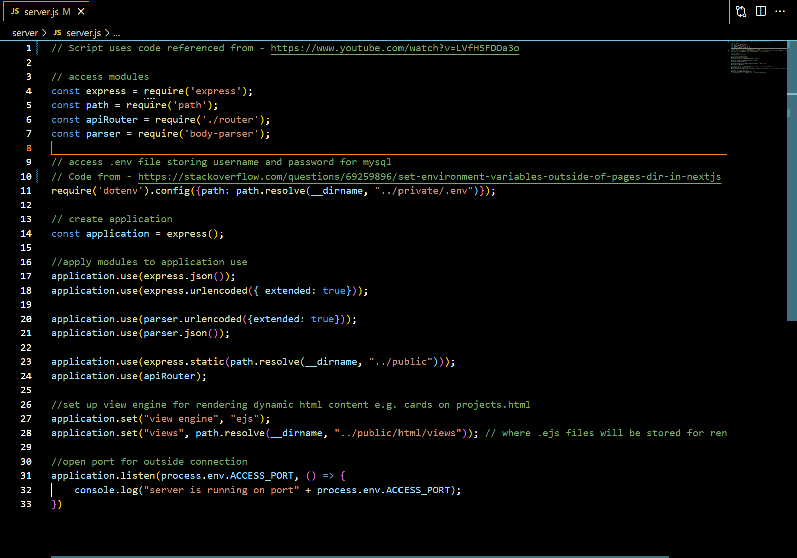
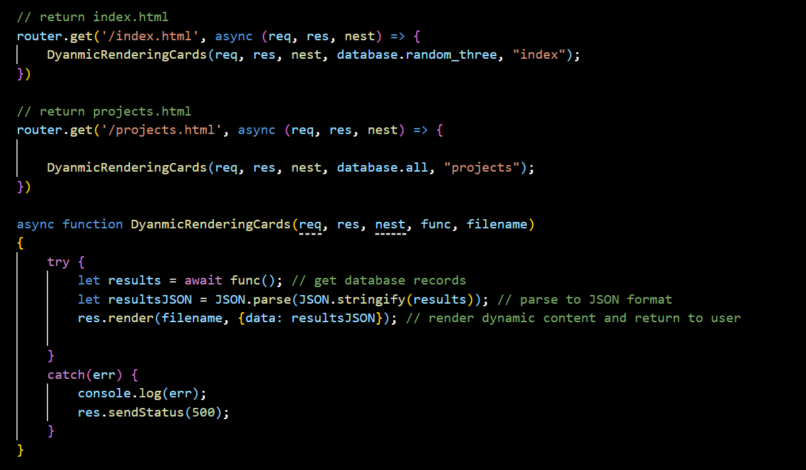
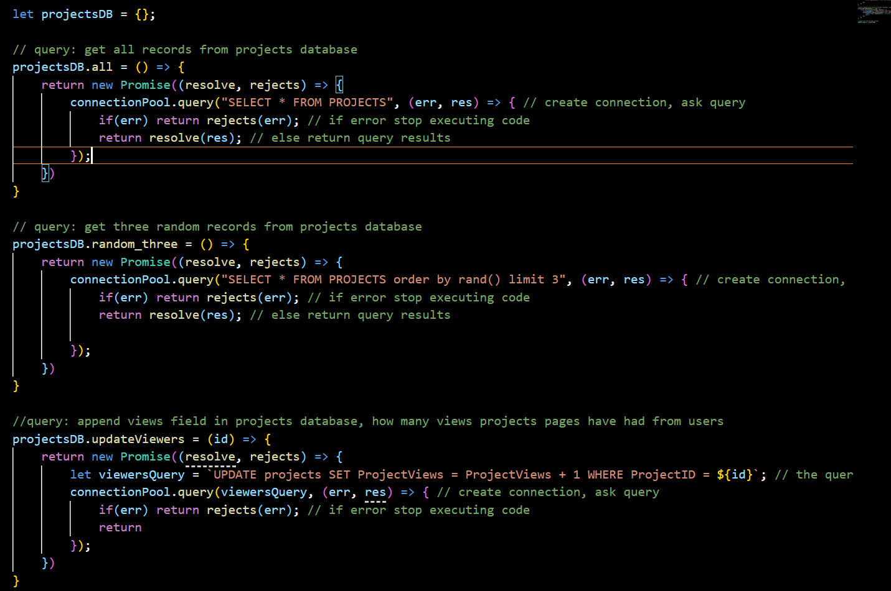
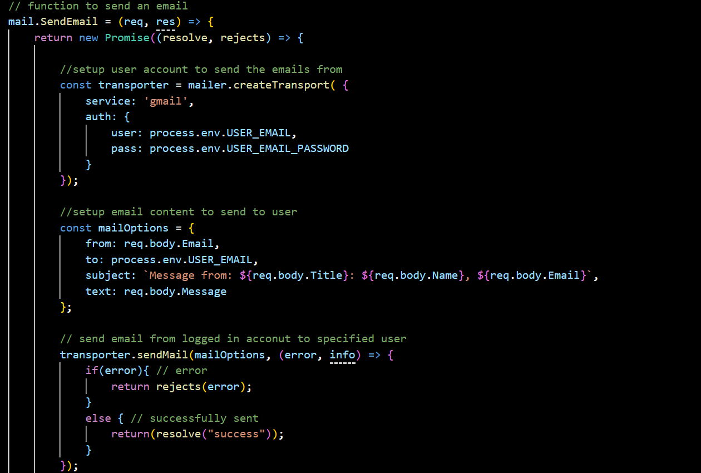

## Backend

### Website Requirements

The requirements for the website were as follows:

* 4 pages
	* Home
	* About 
	* Projects 
	* Contact
* Database
	* Stores project information to be displayed on cards
* Mail functionality
	* Send email from form on contact page

### Data Flow

* The client will send a HTTP request to the server, to get or pass data.
* An API will access this request, and pass on the relevant data to the required scripts.
* These scripts will do their functionality, e.g. database script to connect and communicate with the database.
* The scripts will return the data/status code of the action back to the API controller.
* The API controller will update the view with the data/status code.
* The API controller will then return the requested data/status code back to client.

### Technologies Used

To implement the designs, I used the following technologies:

* Node.js - Environment to run JavaScipt on server.
* Express.js - To build RESTful API controller.
* Nodemailer - Module to send email using data.
* MYSql - To store projects data.

### Implementation

* server.js script.
	* Sets up Express.js application.
	* Adds middleware functionality to application.
	* Sets view engine for rendering dynamic content.
	* Opens port for connection.

* router.js script **CONTROLLER**
	* The REST API for the backend server.
	* Sets up router for recieving client requests.
	* Passes data to Model scripts.
	* Communicates with View via 'res.Send', 'res.SendFile' and 'res.Render' methods.

**Example from code**

* database.js script **MODEL**
	* Creating connection pool between server and database.
	* Recieve requests from router.js.
	* Run queries based on request.
	* Return data / response.

* mail.js script **MODEL**
	* Recieves email data from router.js.
	* Signs in to user account.
	* Formats email.
	* Sends email.
	* Returns whether email was successfully sent to router.js.

