## Optimisation

I have conducted an investigation to improve the performance of my website.

### Method

To conduct my investigation, I have made use of a profiling tool called [Google Lighthouse](https://chrome.google.com/webstore/detail/lighthouse/blipmdconlkpinefehnmjammfjpmpbjk?hl=fr). This is a tool that can be downloaded as a website browser extension that scans the webpage with different tests, and returns an overall score depending on how well the tests do.

Google Lighthouse tests the website for multiple different categories which contribute to the performance of the website, these include the following:

* Performance - Examples include:
	* How fast does the website load content?
	* How long does it take to load resources from the server?
	* Reducing unused Javascript & CSS
	* How big the transfer of files is over the network
	* Javascript execution time
* Accessibility - Examples include:
	* How usable is the website for different types of people, e.g. different languages, disabilities, etc?
	* How can assistive technology interact with the website?
	* Are elements described properly for their purpose?
* Best Practises - Examples include:
	* Does the website use HTTPS?
	* Does the website use the boilerplate template?
	* Does the website properly define the charset?
* SEO (Search Engine) Optimisation - Examples include:
	* Has the website got suitable meta data to be found?
	* Is the website responsive?
	* Are elements described properly for their purpose?
	* Does the document have a suitable font size?

### Identified Issues

After conducting initial tests on my website, and doing some analysis myself, here are the following issues that were identified.

* Performance
	1. Backend code had duplicating functionality.
		* Slower website load times.
	2. Large network payloads were identified.
		* Slower webpage load speeds.
	3. No fallback font while website font is downloading.
		* Font won't render until custom font is downloaded, major issue on mobile devices specifically as they took a lot longer to download on tests.
	4. Images were not properly sized with fixed width/height fields.
		* Increases data transfer and slows down load time.
	5. Images were not in next-gen web formats.
		* Slower downloads and more data consumption from user.

* Accessibility
	1. HTML tag had no language attribute.
		* Screen readers may not announce text correctly.
	2. Links had no discernible name.
		* Reduces user experience for screen readers.
	3. About.html - Graph colours did not have a sufficient contrast ratio
		* Difficult for some users to read/understand.

* SEO
	1. Lacking meta descriptions
		* Used by search engines to gather information about website and rank page compared to other pages. Makes the website harder to find.

### How I resolved them.

#### Performance

##### 1. Backend had duplicating functionality

* Router.js had multiple GET requests doing the same tasks
* I created functions to handle the tasks, and each request instead used that function.

**Before**
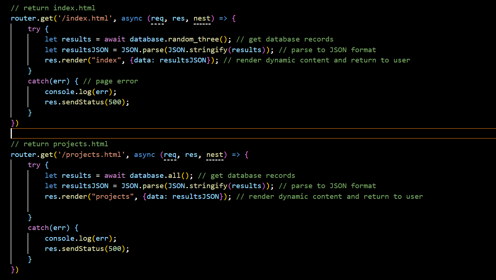
**After**
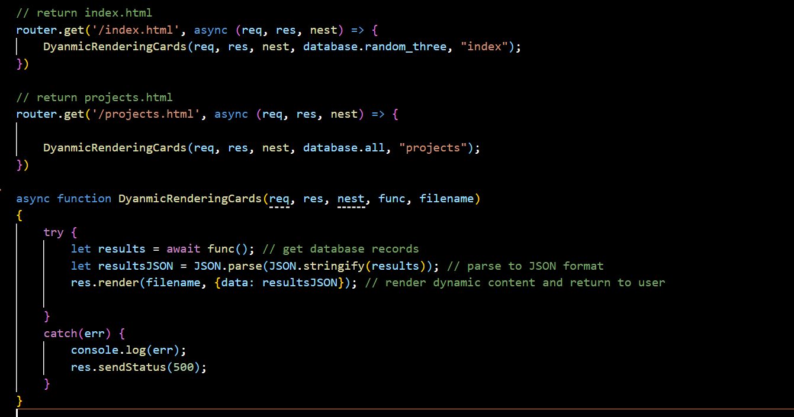

**Before**
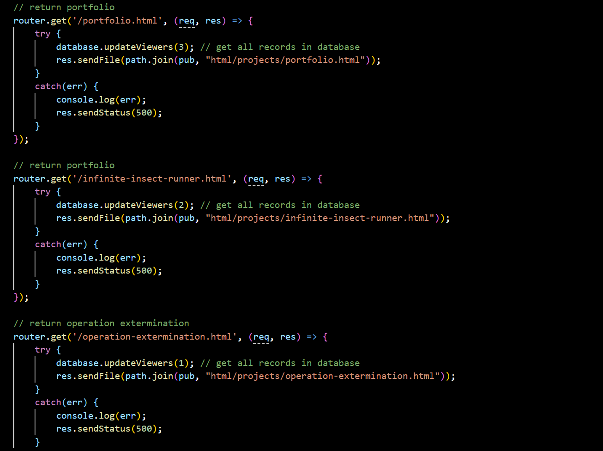
**After**
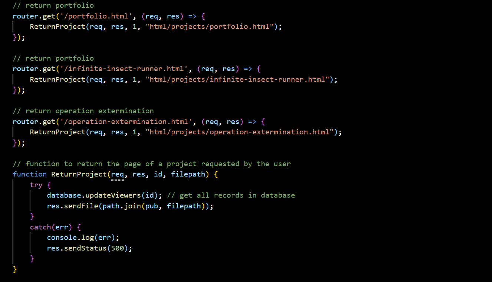

##### 2. Large network payloads were identified

* Removed uneccesary files and content that were not used, including:
	* Old HTML files
	* Unused fonts in fonts folder
	* Unused CSS

* Seperated CSS files, as some pages, such as contact.html, were requesting content it did not need, such as cards.css, that were not used on that page, to reduce uneccessary data requested.

**Before**
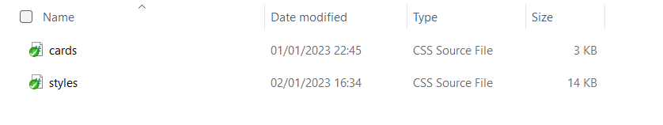
**After**
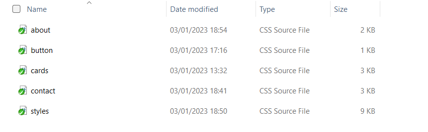

* Compressed images to reduce file sizes when being loaded

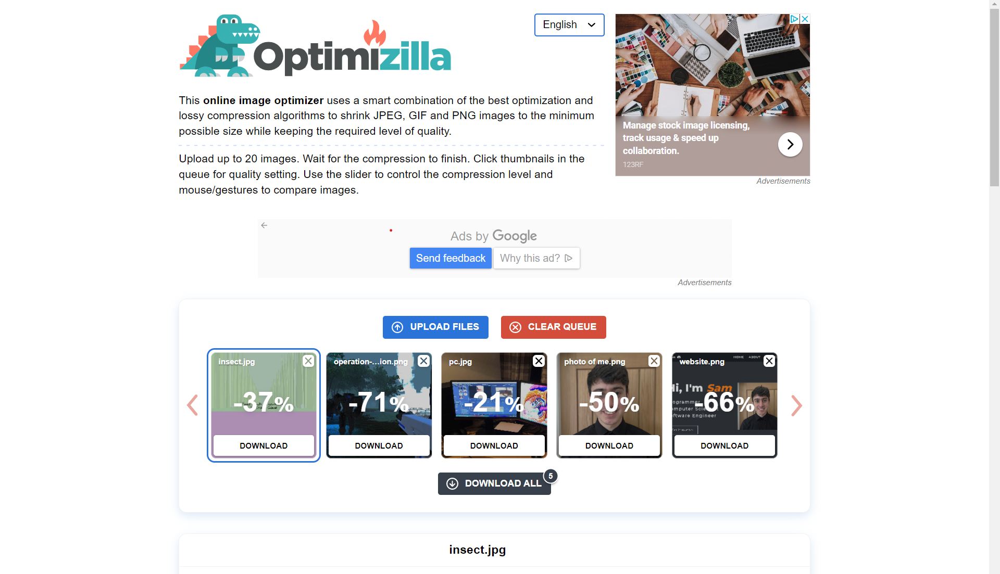

##### 3. No fallback font while website font is downloading

* Added 'font-display: swap' to each font used on website, and set fallback font so that a default font will load, until the requested font has been downloaded.

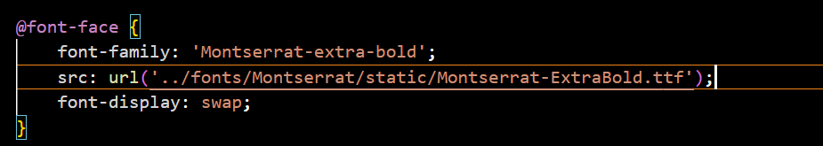

#### Accessibility

##### 1. HTML tag had no language attribute

* Added 'lang=en' to html element on each webpage.

##### 2. Links had no discernible name

* Added 'aria-label' attribute to each link used on page and a description.

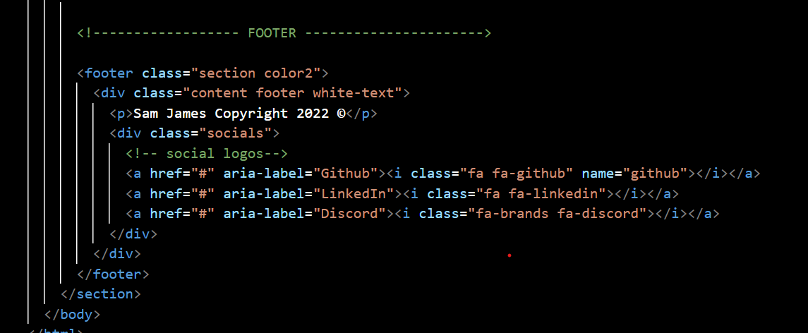

##### 3. About.html - Graph colours did not have a sufficient contrast ratio

* Measured origional colour contrast ratio
* Chose a new colour which had a better contrast ratio
* Modified color in css.

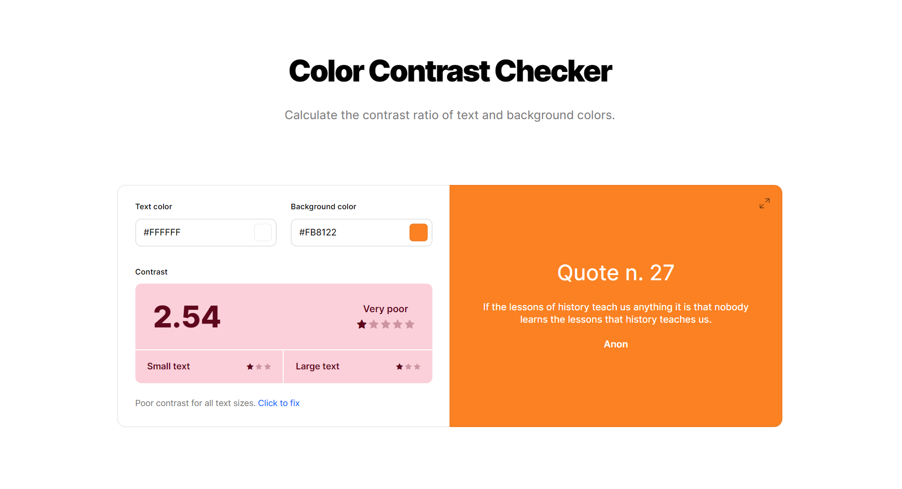
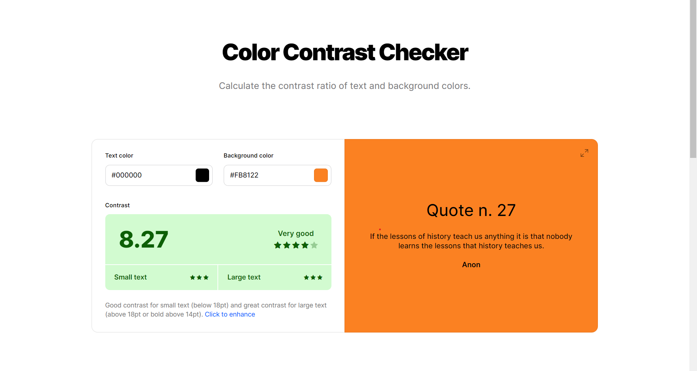

**Before**
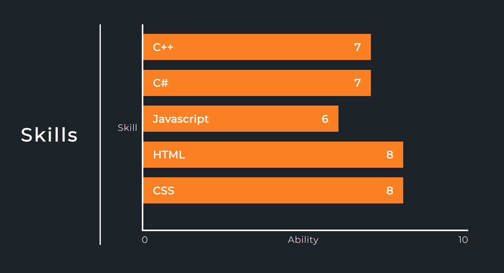
**After**
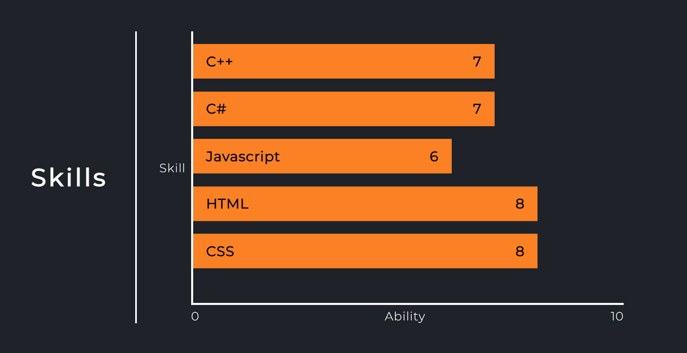

#### SEO

##### 1. Lacking meta descriptions

* I updated the <head> tag in every webpage with some metadata for the website, including:
	* Author
	* Description
	* Keywords

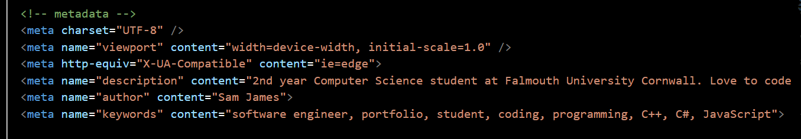

#### Impacts

After I made these changes, I re-ran all of the origional tests that I conducted, to see the impact rating. Here is the before and after:

##### Mobile

|Webpage|Performance|Accessibility|Best Practises|SEO|
|:------|:----------|:------------|:-------------|:--|
|index.html|98->100|87->98|100->100|92->100|
|about.html|80->100|85->100|100->100|92->100|
|projects.html|83->100|84->98|100->100|92->100|
|contact.html|81->100|92->100|100->100|92->100|

##### Desktop	

|Webpage|Performance|Accessibility|Best Practises|SEO|
|:------|:----------|:------------|:-------------|:--|
|index.html|100->100|87->98|100->100|90->100|
|about.html|99->100|85->100|100->100|90->100|
|projects.html|99->100|84->98|100->100|90->100|
|contact.html|99->100|92->100|100->100|90->100|

