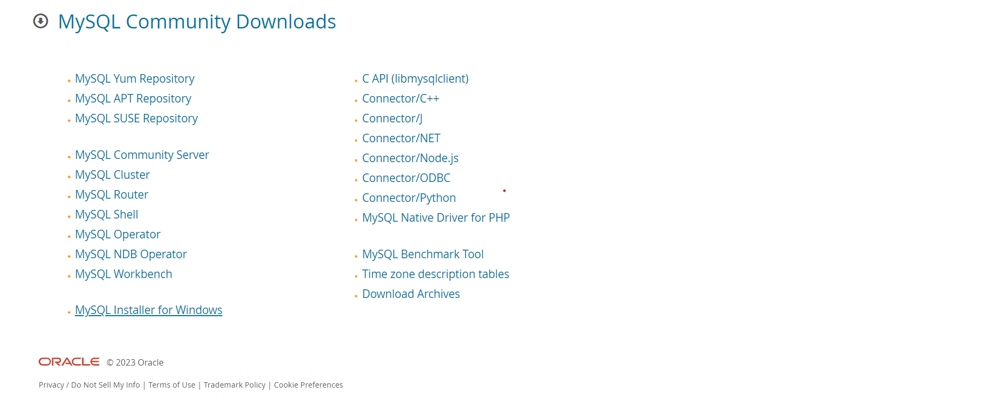
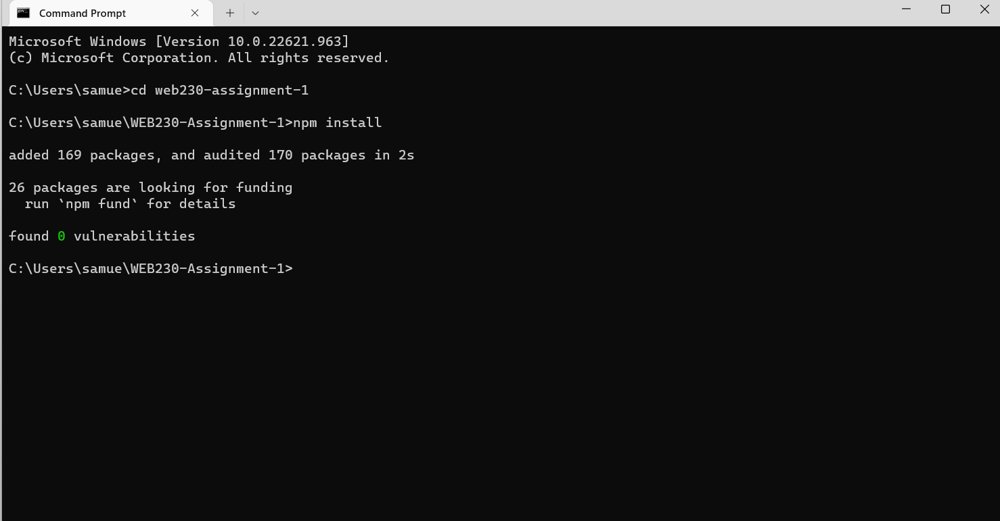
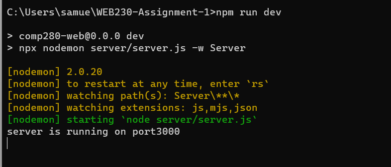
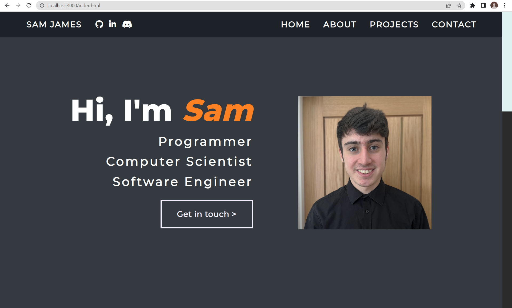

## Personal Portfolio Website

### About Project

As part of my course in my second year, I created a personal portfolio website. The website includes:
* Front End
  * Home Page
  * About Page
  * Projects Page
  * Contact Page
* Back End
  * GET/POST REST API
  * Projects Database
  * Dynamic HTML generation
  * Send email from contact form

### Technologies Used

* HTML
* CSS
* JavaScript
* MySQL & SQL
* Node.Js
* Express.Js

### Setup Information

1. Clone / Download repository
2. Install and setup [MySql Installer](https://dev.mysql.com/downloads/installer/). 
3. Install [Node.js](https://nodejs.org/en/).
4. Create database in MySQL 
5. Use [CardsDatabase.sql](https://github.falmouth.ac.uk/SJ272585/WEB230-Assignment-1/blob/main/server/sql/CardsDatabase.sql) queries to setup database.
6. Move [.env file](https://github.falmouth.ac.uk/SJ272585/WEB230-Assignment-1/blob/main/documentation/.env) into private folder and fill in fields.
7. Open CMD, select repo as current directory, and run **'npm install'** to install node dependencies. 
8. Open CMD, select repo and run **'npm run dev'** 
9. Open browser, open **localhost:portnumber/page i.e. localhost:3000/index.html** 
